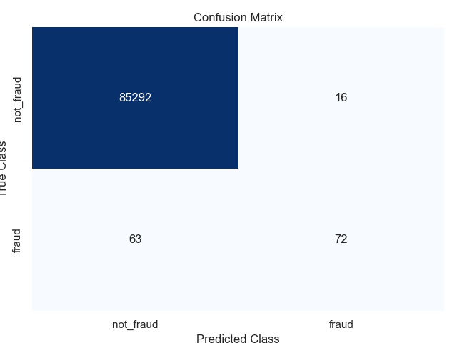

# Credit Card Fraud Detection

## Overview
This project focuses on detecting fraudulent credit card transactions using machine learning. The dataset contains transactions made by European cardholders in September 2013. The goal is to build a model that can accurately classify transactions as either fraudulent or non-fraudulent.

## Dataset
The dataset used in this project is the **Credit Card Fraud Detection** dataset, which can be found on [Kaggle](https://www.kaggle.com/mlg-ulb/creditcardfraud). It contains 284,807 transactions, of which 492 are fraudulent. The dataset is highly imbalanced, with frauds accounting for only 0.172% of all transactions.

### Features
- **V1-V28**: Principal components obtained through PCA (anonymized for privacy reasons).
- **Amount**: The transaction amount.
- **Class**: The target variable (1 for fraud, 0 for non-fraud).

## Project Steps
1. **Exploratory Data Analysis (EDA)**:
   - Analyzed the distribution of classes (fraud vs. non-fraud).
   - Visualized the features to understand their behavior.

2. **Data Preprocessing**:
   - Split the dataset into training and testing sets (70% training, 30% testing).

3. **Model Training**:
   - Trained a Logistic Regression model to classify transactions.

4. **Model Evaluation**:
   - Evaluated the model using a confusion matrix, F1 score, and recall.

## Results
### Confusion Matrix


### Evaluation Metrics
- **F1 Score**: 0.85
- **Recall (Sensitivity)**: 0.82

The model performs well in detecting fraudulent transactions, with a high recall score indicating that it captures most of the fraud cases.

## How to Run the Code
1. Clone this repository:
   ```bash
   git clone https://github.com/your-username/credit-card-fraud-detection.git
